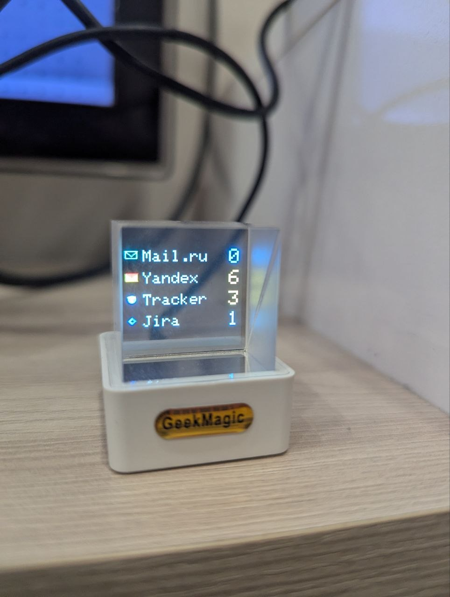

# Magic Qube Mail Dashboard Integration

<p align="center">
  
</p>

Node.js сервис для Raspberry Pi, который:

- опрашивает почтовые интеграции по IMAP;
- хранит состояние в MongoDB;
- рисует дашборд на ESP (через Drawing API);
- обновляет счетчики в реальном времени по расписанию.

## Что умеет

- несколько типов интеграций:
  - `yandex_imap` (обычный счетчик непрочитанных);
  - `mailru_imap` (обычный счетчик непрочитанных);
  - `yandex_tracker_imap` (парсинг задач из писем Tracker);
  - `mail_gs_tracker_imap` (парсинг `GS-xxxx` + завершение по письмам от `gitlab@***.com.ru`);
- устойчивый scheduler с ограничением параллелизма;
- full/delta рендер на ESP;
- автополный ререндер экрана (восстановление после перезапуска кубика);
- шифрование credentials в БД (если задан `CREDENTIALS_ENCRYPTION_KEY`).

## Стек

- Node.js + TypeScript
- Express
- MongoDB + Mongoose
- imapflow + mailparser
- pino
- Docker + Docker Compose
- GitHub Actions (self-hosted runner)

## Быстрый старт (локально)

```bash
npm install
cp .env.example .env
npm run dev
```

Прод:

```bash
npm run build
npm start
```

## Переменные окружения

Минимально нужные:

- `API_KEY`
- `MONGO_URI`
- `ESP_BASE_URL`
- `DEFAULT_POLL_INTERVAL_SEC`
- `SCHEDULER_TICK_SEC`
- `MAX_CONCURRENT_JOBS`
- `IMAP_CONNECT_TIMEOUT_MS`
- `CREDENTIALS_ENCRYPTION_KEY`

ESP-рендер:

- `ESP_TIMEOUT_MS`
- `ESP_RETRY_COUNT`
- `ESP_RETRY_DELAY_MS`
- `ESP_FULL_RENDER_INTERVAL_SEC`
- `STOP_GIF_ON_RENDER`

Сетевые:

- `HOST`
- `PORT`

Полный пример значений: [.env.example](./.env.example)

## API

Без ключа:

- `GET /health`

С `X-API-Key`:

- `GET /integrations`
- `POST /integrations`
- `PATCH /integrations/:id`
- `POST /sync`
- `GET /dashboard/state`

Пример header:

```http
X-API-Key: <API_KEY>
```

## Логика рендера ESP

- `startup` -> full render;
- `manual /sync` -> full render;
- обычный scheduled sync -> delta, если изменились только счетчики;
- при недоступности ESP -> следующая успешная отправка делает full render;
- периодический full render каждые `ESP_FULL_RENDER_INTERVAL_SEC`.

## Коллекции Mongo

### `integrations`

Настройки интеграций и последнее состояние:

- тип, label, цвет, интервал;
- `credentialsEnc`;
- `lastUnreadCount`, `lastCheckedAt`, `lastError`, `nextRunAt`.

### `tracker_tasks`

Текущая "карта" задач tracker-интеграций (активные ключи задач).

### `processed_tracker_mails`

Дедуп обработанных писем (`uid`/`uidValidity`), чтобы одно письмо не считалось повторно.

### `dashboard_snapshots`

Снимки состояния дашборда для отладки.

## Docker

Локально:

```bash
docker compose up -d --build
docker compose logs -f
```

Файлы:

- [Dockerfile](./Dockerfile)
- [docker-compose.yml](./docker-compose.yml)

## CI/CD (GitHub Actions)

Workflow: [.github/workflows/main.yml](./.github/workflows/main.yml)

Триггеры:

- push в `main`;
- ручной запуск `workflow_dispatch`.

Ожидается self-hosted runner с Docker/Docker Compose.

## Systemd (альтернативный запуск на Raspberry Pi)

Файл: [deploy/magic-qube-mail.service](./deploy/magic-qube-mail.service)

```bash
sudo cp deploy/magic-qube-mail.service /etc/systemd/system/
sudo systemctl daemon-reload
sudo systemctl enable magic-qube-mail
sudo systemctl start magic-qube-mail
sudo systemctl status magic-qube-mail
```

## Полезно для диагностики

- Принудительно обновить экран:

```bash
curl -X POST http://localhost:3001/sync -H "X-API-Key: <API_KEY>"
```

- Проверить текущее состояние:

```bash
curl http://localhost:3001/dashboard/state -H "X-API-Key: <API_KEY>"
```
